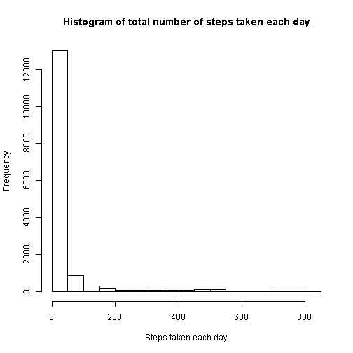

Reproducible Research 
=====================
## Peer Assessment 1

## Author:  Sumithra Krishnan

### Introduction

It is now possible to collect a large amount of data about personal movement using activity monitoring devices such as a Fitbit, Nike Fuelband, or Jawbone Up. These type of devices are part of the "quantified self" movement - a group of enthusiasts who take measurements about themselves regularly to improve their health, to find patterns in their behavior, or because they are tech geeks. But these data remain under-utilized both because the raw data are hard to obtain and there is a lack of statistical methods and software for processing and interpreting the data.

This assignment makes use of data from a personal activity monitoring device. This device collects data at 5 minute intervals through out the day. The data consists of two months of data from an anonymous individual collected during the months of October and November, 2012 and include the number of steps taken in 5 minute intervals each day.

### Data

The data for this assignment can be downloaded from the course web site:
.Dataset: Activity monitoring data [52K]

The variables included in this dataset are:

.steps: Number of steps taking in a 5-minute interval (missing values are coded as NA)

.date: The date on which the measurement was taken in YYYY-MM-DD format

.interval: Identifier for the 5-minute interval in which measurement was taken

The dataset is stored in a comma-separated-value (CSV) file and there are a total of 17,568 observations in this dataset.

### Assignment questions and answers

Set global options for R code chunks. 

```r
library(knitr) 
opts_chunk$set(echo=TRUE, results="asis")
```
#### Loading and preprocessing the data

Show any code that is needed to

1.Load the data (i.e. read.csv())

2.Process/transform the data (if necessary) into a format suitable for your analysis


```r
## Read csv into R
act_data <- read.csv("./data/activity.csv")
```

#### What is mean total number of steps taken per day?
For this part of the assignment, you can ignore the missing values in the dataset.

```r
## Omit NA values for this step
noNA_data <- na.omit(act_data)
```

1.Make a histogram of the total number of steps taken each day

```r
## Make histogram and label appropriately
hist(noNA_data$steps,
     main="Histogram of total number of steps taken each day",
     xlab = "Steps taken each day")
```

 

2.Calculate and report the mean and median total number of steps taken per day

```r
## Mean total number of steps
totals = aggregate(steps ~ date, data=noNA_data, sum)
totalmean <- mean(totals[,2])
```
Mean total number of steps taken per day is 1.0766189 &times; 10<sup>4</sup>.


```r
## Median total number of steps
totals = aggregate(steps ~ date, data=noNA_data, sum)
totalmedian <- median(totals[,2])
```
Median total number of steps taken per day is 10765.

#### What is the average daily activity pattern?

1.Make a time series plot (i.e. type = "l") of the 5-minute interval (x-axis) and the average number of steps taken, averaged across all days (y-axis)

```r
## Aggregate to find out average steps per 5 minute interval
totals = aggregate(steps ~ interval, data=noNA_data, mean)

## Plot time series
plot(totals[,1], 
     totals[,2], 
     main="Time series plot of 5 minutes interval and average steps", 
     type = "l",
     xlab="Minutes",
     ylab="Average number of steps taken, averaged across all days")
```

 

2.Which 5-minute interval, on average across all the days in the dataset, contains the maximum number of steps?


```r
## Find out the 5 minutes interval with max steps
x <- which.max(totals[,2])
int <- totals[x,][1]
```
5-minute interval, on average across all the days in the dataset, which contains the maximum number of steps is 835.

#### Imputing missing values

Note that there are a number of days/intervals where there are missing values (coded as NA). The presence of missing days may introduce bias into some calculations or summaries of the data.

1.Calculate and report the total number of missing values in the dataset (i.e. the total number of rows with NAs)

```r
## Find total number of rows with NA
numNA <- sum(is.na(act_data))
```
Total number of missing values in the dataset is 2304. 

2.Devise a strategy for filling in all of the missing values in the dataset. The strategy does not need to be sophisticated. For example, you could use the mean/median for that day, or the mean for that 5-minute interval, etc.

```r
## Strategy is to use mean for the particular 5 minute interval to fill in place of NA.  
## Aggregate to find out average steps per 5 minute interval
totals = aggregate(steps ~ interval, data=noNA_data, mean)
```

3.Create a new dataset that is equal to the original dataset but with the missing data filled in.

```r
## Check for NA in actual data and fill in with the average steps for the particular 5 minute interval. 
for (i in 1:nrow(act_data)) {
  if (is.na(act_data[i,1])){
    x <- subset(totals, act_data[i,3] == totals$interval)
    act_data[i,1] <- x[1,2]
  }
}
```

4.Make a histogram of the total number of steps taken each day and Calculate and report the mean and median total number of steps taken per day. Do these values differ from the estimates from the first part of the assignment? What is the impact of imputing missing data on the estimates of the total daily number of steps?

```r
## Make new histogram and label appropriately
hist(act_data$steps,
     main="Histogram of total number of steps taken each day (on imputed data)",
     xlab = "Steps taken each day")
```

 


```r
## Mean total number of steps
totals = aggregate(steps ~ date, data=act_data, sum)
totalmean <- mean(totals[,2])
```
Mean total number of steps taken per day (from imputed data) is 1.0766189 &times; 10<sup>4</sup>.


```r
## Median total number of steps
totals = aggregate(steps ~ date, data=act_data, sum)
totalmedian <- median(totals[,2])
```
Median total number of steps taken per day (from imputed data) is 1.0766189 &times; 10<sup>4</sup>.

Answer: On imputing, there is no difference in the mean of the total steps but there is slight difference in the median of the total steps. 

#### Are there differences in activity patterns between weekdays and weekends?

For this part the weekdays() function may be of some help here. Use the dataset with the filled-in missing values for this part.

1.Create a new factor variable in the dataset with two levels - "weekday" and "weekend" indicating whether a given date is a weekday or weekend day.

```r
## Initialize fourth column on the existing dataset
act_data[4] <- 0

## Name the column as day
names(act_data)[4] <- "day"
 
## Fill in the new column with the corresponding day
weekday <- c("Monday", "Tuesday", "Wednesday", "Thursday", "Friday")
weekend <- c("Saturday", "Sunday")

## Find whether weekday or weekend and fill the dataset
for (i in 1:nrow(act_data)) {
  if (weekdays(as.Date(act_data$date[i])) %in% weekday) {
    act_data$day[i] <- "weekday"
  }
  if (weekdays(as.Date(act_data$date[i])) %in% weekend) {
    act_data$day[i] <- "weekend"
  }
}
```

2.Make a panel plot containing a time series plot (i.e. type = "l") of the 5-minute interval (x-axis) and the average number of steps taken, averaged across all weekday days or weekend days (y-axis). See the README file in the GitHub repository to see an example of what this plot should look like using simulated data.

```r
## Find mean of the weekdays
totals_1 = aggregate(steps ~ interval, data=subset(act_data, day=="weekday"), mean)
totals_1[3] <- "weekday"

## Find mean of the weekends
totals_2 = aggregate(steps ~ interval, data=subset(act_data, day=="weekend"), mean)
totals_2[3] <- "weekend"
                        
## Combine to get single dataset
combine <- rbind(totals_1, totals_2)
names(combine)[3] <- "day"

## Lattice panel plot and label appropriately
library(lattice)

xyplot(steps ~ interval | day, 
       data=combine, 
       type="l", 
       layout = c(1,2),
       xlab = "Interval",
       ylab = "Average number of steps",
       main = "Panel plot showing activity patterns between weekdays and weekends")
```

 
